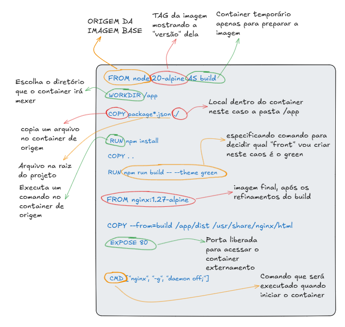

# Docker Learning

## Exemplo React Com Material UI

Este branch contém um exemplo React usando Vite e Material UI com a tela
`WelcomeBlue`.

### Executar Localmente

Instale as dependências:

```powershell
npm install
```

Inicie o servidor de desenvolvimento:

```powershell
npm run dev
```

Depois acesse a URL exibida no terminal, normalmente:

```text
http://localhost:5173
```

Para gerar o build com a tela azul:

```powershell
npm run build -- --theme blue
```

Para gerar o build com a tela verde:

```powershell
npm run build -- --theme green
```

### Executar Com Docker

Crie a imagem com a tela azul:

```powershell
docker build -f Dockerfile.blue -t react-welcome-blue .
```

Crie a imagem com a tela verde:

```powershell
docker build -f Dockerfile.green -t react-welcome-green .
```

### Explicando O Dockerfile

Os arquivos `Dockerfile.blue` e `Dockerfile.green` usam o mesmo fluxo:

- primeiro usam uma imagem Node para instalar dependências e gerar o build do React;
- depois usam uma imagem Nginx para publicar os arquivos estáticos gerados;
- a diferença entre eles é o tema passado no comando `npm run build`.

Veja o exemplo comentado:



Execute o container:

```powershell
docker run -d -p 8080:80 --name react-welcome-blue react-welcome-blue
```

Acesse no navegador:

```text
http://localhost:8080
```

### Executar Com Docker Compose E HAProxy

O Compose cria duas imagens, uma azul e outra verde, e sobe um HAProxy para
balancear as requisições entre os dois frontends.

Suba o ambiente:

```powershell
docker compose up --build -d
```

Acesse a aplicação balanceada:

```text
http://localhost:8080
```

Acesse o painel de estatísticas do HAProxy:

```text
http://localhost:8404
```

Pare e remova os containers:

```powershell
docker compose down
```

### O Que É Deploy

Deploy é o processo de publicar uma aplicação em um ambiente onde ela possa ser
acessada pelos usuários.

Em um fluxo com Docker, isso normalmente envolve:

- criar a imagem da aplicação;
- iniciar um ou mais containers com essa imagem;
- expor uma porta ou configurar um proxy reverso;
- validar se a aplicação está respondendo corretamente;
- substituir ou remover versões antigas quando a nova versão estiver estável.

Neste projeto, quando você executa:

```powershell
docker compose up --build -d
```

o Docker faz o build das imagens `react-welcome-blue` e `react-welcome-green`,
sobe os containers e publica o acesso pelo HAProxy em `http://localhost:8080`.
Esse processo é um exemplo simples de deploy local.

### Exemplo De Deploy Canário

Deploy canário é uma estratégia em que uma nova versão da aplicação recebe
apenas uma parte do tráfego no início. Se ela funcionar bem, mais tráfego é
enviado para essa nova versão. Se houver erro, é possível voltar para a versão
anterior com menor impacto.

Neste exemplo, podemos considerar:

- `welcome-blue`: versão atual estável;
- `welcome-green`: nova versão sendo testada;
- `haproxy`: balanceador que decide para qual versão enviar as requisições.

Um exemplo de canário seria enviar a maior parte das requisições para o blue e
uma parte menor para o green. No HAProxy, isso pode ser feito usando pesos:

```haproxy
backend welcome_backends
    balance roundrobin
    option httpchk GET /
    server welcome_blue welcome-blue:80 check weight 9
    server welcome_green welcome-green:80 check weight 1
```

Com essa configuração, aproximadamente 90% das requisições vão para o
`welcome-blue` e 10% vão para o `welcome-green`.

Depois de validar que a versão green está funcionando, os pesos podem ser
ajustados gradualmente:

```haproxy
server welcome_blue welcome-blue:80 check weight 5
server welcome_green welcome-green:80 check weight 5
```

E, no final, todo o tráfego pode ser direcionado para a versão nova:

```haproxy
server welcome_blue welcome-blue:80 check weight 0
server welcome_green welcome-green:80 check weight 10
```

Se a versão nova apresentar problemas, basta voltar o peso maior para o blue.

Este repositório tem fins acadêmicos e reúne exemplos práticos de criação de imagens Docker para casos de uso específicos.

A proposta é que cada branch apresente um cenário diferente, com explicações passo a passo sobre como o `Dockerfile` funciona, como criar a imagem, como executar o container e como acessar ou testar o resultado.

Em vez de concentrar todos os exemplos em uma única branch, este repositório organiza os conteúdos por branches. Assim, cada caso fica mais simples de estudar, comparar e executar.

## Branches Disponíveis

### `main`

Branch principal do repositório.

Ela serve como ponto de entrada e explica o caráter geral do projeto. Use esta branch para entender a organização do repositório e decidir qual exemplo estudar.

### `container-nginx`

Exemplo de criação de uma imagem Docker usando Nginx para publicar um site estático.

Esta branch é útil para estudar:

- uso da imagem oficial do Nginx;
- cópia de arquivos HTML, CSS, JavaScript e assets para dentro do container;
- configuração de servidor web;
- publicação de conteúdo estático;
- mapeamento de portas entre máquina local e container.

### `container-tomcat`

Exemplo de criação de uma imagem Docker usando Apache Tomcat para executar uma aplicação Java empacotada em `.war`.

Esta branch é útil para estudar:

- uso da imagem oficial do Tomcat;
- uso de Java dentro do container;
- cópia de arquivo `.war` para a pasta `webapps`;
- publicação da aplicação como `ROOT.war`;
- execução de aplicações Java web em container.


## Qual Branch Escolher?

Use este guia rápido:

```text
Quero publicar um site estático
-> container-nginx

Quero executar uma aplicação Java .war
-> container-tomcat

Quero entender a organização geral do repositório
-> main
```

## Pré-Requisitos Gerais

Para executar os exemplos, é recomendado ter instalado:

- Docker Desktop;
- Git;
- terminal PowerShell, Prompt de Comando, Git Bash ou equivalente;
- navegador web, quando o exemplo publicar uma aplicação acessível por HTTP.

Docker Desktop:

```text
https://www.docker.com/products/docker-desktop/
```

Git:

```text
https://git-scm.com/
```

Após instalar o Docker, verifique se ele está funcionando:

```powershell
docker --version
```

Também é possível verificar se o serviço está ativo:

```powershell
docker ps
```

## Fluxo Geral De Estudo

Uma forma recomendada de usar este repositório é:

1. Acessar a branch `main`.
2. Escolher o caso de uso desejado.
3. Trocar para a branch correspondente.
4. Ler o `README.md` da branch.
5. Conferir o `Dockerfile`.
6. Criar a imagem Docker.
7. Executar o container.
8. Testar o resultado.
9. Comparar com outras branches para entender as diferenças.

## Comandos Git Úteis

### Ver Branch Atual

```powershell
git branch --show-current
```

### Listar Branches Locais

```powershell
git branch
```

### Listar Branches Locais E Remotas

```powershell
git branch -a
```

### Trocar De Branch

```powershell
git checkout nome-da-branch
```

Exemplo:

```powershell
git checkout container-tomcat
```

### Atualizar Informações Do Repositório Remoto

```powershell
git fetch
```

## Comandos Docker Mais Comuns

Os comandos exatos podem variar conforme a branch, mas normalmente os exemplos seguem este padrão:

```powershell
docker build -t nome-da-imagem .
```

```powershell
docker run -d -p porta-local:porta-container --name nome-do-container nome-da-imagem
```

Para listar containers em execução:

```powershell
docker ps
```

Para parar um container:

```powershell
docker stop nome-do-container
```

Para remover um container parado:

```powershell
docker rm nome-do-container
```

Para ver logs:

```powershell
docker logs nome-do-container
```

## Observação

Cada branch foi pensada como um exemplo independente. Por isso, arquivos, portas, nomes de imagens e comandos podem mudar de uma branch para outra.

Sempre leia o `README.md` da branch escolhida antes de executar os comandos.
