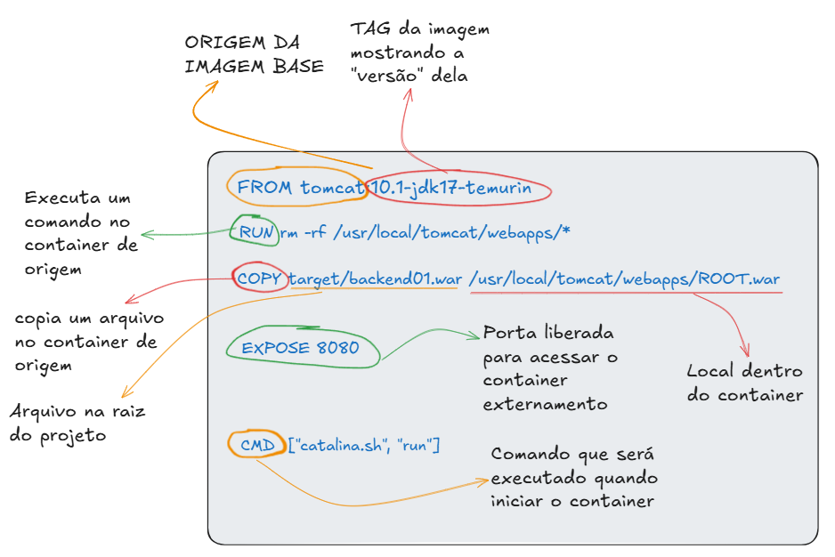

# Docker Learning

Este repositório tem fins acadêmicos e demonstra como usar Docker para publicar uma aplicação Java `.war` com Apache Tomcat.

O projeto contém um arquivo `backend01.war` dentro da pasta `target/`. O Docker é usado para empacotar esse arquivo dentro de um container com Tomcat, permitindo que a aplicação seja executada da mesma forma em qualquer máquina que tenha Docker instalado.

## Estrutura Do Projeto

```text
docker-learning/
├── Dockerfile
├── .gitattributes
└── target/
    └── backend01.war
```

## Como O Projeto Funciona

O funcionamento geral é:

1. O Docker usa uma imagem oficial do Tomcat com Java 17.
2. As aplicações padrão do Tomcat são removidas.
3. O arquivo `.war` da aplicação é copiado para a pasta `webapps` do Tomcat.
4. O arquivo é renomeado para `ROOT.war`, fazendo a aplicação responder na raiz do servidor.
5. A porta `8080` é exposta.
6. O Tomcat é iniciado para executar a aplicação.

## Dockerfile Explicado

Arquivo utilizado pelo projeto:

```dockerfile
# Usa uma imagem oficial do Tomcat com Java 17
FROM tomcat:10.1-jdk17-temurin

# Remove aplicações padrão do Tomcat
RUN rm -rf /usr/local/tomcat/webapps/*

# Copia o arquivo .war da aplicação para o Tomcat
# Renomeie "minha-aplicacao.war" conforme necessário
COPY target/backend01.war /usr/local/tomcat/webapps/ROOT.war

# Expõe a porta padrão do Tomcat
EXPOSE 8080

# Inicia o Tomcat
CMD ["catalina.sh", "run"]
```

### `FROM tomcat:10.1-jdk17-temurin`

Define a imagem base usada para criar a imagem do projeto.

Neste caso:

- `tomcat` é a imagem oficial do Apache Tomcat;
- `10.1` indica a versão principal do Tomcat usada;
- `jdk17` indica que a imagem já contém o Java Development Kit 17;
- `temurin` indica a distribuição Java usada pela imagem.

Essa imagem já possui o Tomcat instalado e pronto para receber aplicações Java empacotadas em `.war`.

### `RUN rm -rf /usr/local/tomcat/webapps/*`

Executa um comando durante a criação da imagem.

Neste projeto, remove as aplicações padrão que vêm junto com a imagem oficial do Tomcat.

Isso evita que páginas ou aplicações padrão do Tomcat sejam exibidas no lugar da aplicação do projeto.

O comando `RUN` é usado para preparar a imagem, por exemplo:

- instalar pacotes;
- remover arquivos;
- criar diretórios;
- alterar permissões;
- executar comandos necessários antes do container iniciar.

Exemplo:

```dockerfile
RUN mkdir /app
```

### `COPY target/backend01.war /usr/local/tomcat/webapps/ROOT.war`

Copia o arquivo `.war` do repositório para dentro da imagem Docker.

Formato geral:

```dockerfile
COPY origem destino
```

No projeto:

```dockerfile
COPY target/backend01.war /usr/local/tomcat/webapps/ROOT.war
```

Isso copia o arquivo:

```text
target/backend01.war
```

para:

```text
/usr/local/tomcat/webapps/ROOT.war
```

Dentro do Tomcat, a pasta `webapps` é usada para publicar aplicações web Java.

Ao copiar o arquivo como `ROOT.war`, a aplicação fica disponível diretamente na raiz do servidor. Ou seja, ela pode ser acessada em:

```text
http://localhost:8080
```

Se o arquivo fosse copiado com outro nome, por exemplo:

```dockerfile
COPY target/backend01.war /usr/local/tomcat/webapps/backend01.war
```

a aplicação normalmente seria acessada em:

```text
http://localhost:8080/backend01
```

### `EXPOSE 8080`

Informa que o container utiliza a porta `8080`.

Importante: `EXPOSE` apenas documenta a porta usada pelo container. Ele não libera automaticamente essa porta na máquina local.

Para acessar a aplicação pelo navegador, é necessário mapear a porta com `-p` no comando `docker run`.

Exemplo:

```powershell
docker run -p 8080:8080 app-tomcat
```

Nesse exemplo:

- `8080` antes dos dois pontos é a porta da máquina do aluno;
- `8080` depois dos dois pontos é a porta interna do container.

Também é possível usar outra porta na máquina local:

```powershell
docker run -p 3000:8080 app-tomcat
```

Nesse caso, a aplicação será acessada em:

```text
http://localhost:3000
```

### `CMD ["catalina.sh", "run"]`

Define o comando executado quando o container inicia.

Neste projeto, o comando inicia o Tomcat.

O script `catalina.sh` é usado para controlar o servidor Tomcat. O parâmetro `run` mantém o Tomcat rodando em primeiro plano.

Isso é necessário porque o Docker mantém o container ativo enquanto o processo principal estiver em execução.

## Pré-Requisitos

Antes de executar o projeto, o aluno precisa ter instalado:

- Docker Desktop;
- terminal PowerShell, Prompt de Comando, Git Bash ou outro terminal equivalente;
- navegador web.

Docker Desktop:

```text
https://www.docker.com/products/docker-desktop/
```

Após instalar, verifique se o Docker está funcionando:

```powershell
docker --version
```

Também é possível verificar se o serviço está ativo:

```powershell
docker ps
```

## Passo A Passo Para Executar

### 1. Acessar A Pasta Do Projeto

No terminal, entre na pasta do repositório:

```powershell
cd caminho\para\docker-learning
```

Exemplo:

```powershell
cd C:\Users\Aluno\Documents\GitHub\docker-learning
```

### 2. Conferir O Arquivo `.war`

Antes de criar a imagem Docker, confira se o arquivo `.war` existe:

```powershell
dir target
```

O Dockerfile espera encontrar o arquivo neste caminho:

```text
target/backend01.war
```

Se o nome do arquivo `.war` for diferente, altere a linha `COPY` no `Dockerfile`.

### 3. Criar A Imagem Docker

Execute:

```powershell
docker build -t app-tomcat .
```

Explicação dos parâmetros:

- `docker build`: cria uma imagem Docker a partir de um `Dockerfile`;
- `-t app-tomcat`: define o nome da imagem como `app-tomcat`;
- `.`: indica que o Docker deve usar a pasta atual como contexto de build.

### 4. Executar O Container

Execute:

```powershell
docker run -d -p 8080:8080 --name meu-tomcat app-tomcat
```

Explicação dos parâmetros:

- `docker run`: cria e inicia um container;
- `-d`: executa o container em segundo plano;
- `-p 8080:8080`: mapeia a porta `8080` da máquina para a porta `8080` do container;
- `--name meu-tomcat`: define o nome do container como `meu-tomcat`;
- `app-tomcat`: informa qual imagem será usada.

### 5. Acessar A Aplicação

Abra o navegador e acesse:

```text
http://localhost:8080
```

## Explicação Visual Do Docker

Após executar o passo a passo, o fluxo básico do Docker neste projeto é:

```text
Dockerfile -> Imagem Docker -> Container -> Aplicação Java no Tomcat
```



## Comandos Úteis Do Docker

### Listar Containers Em Execução

```powershell
docker ps
```

### Listar Todos Os Containers

```powershell
docker ps -a
```

### Parar O Container

```powershell
docker stop meu-tomcat
```

### Iniciar O Container Novamente

```powershell
docker start meu-tomcat
```

### Remover O Container

Antes de remover, o container precisa estar parado.

```powershell
docker rm meu-tomcat
```

### Remover A Imagem

```powershell
docker rmi app-tomcat
```

### Ver Logs Do Container

```powershell
docker logs meu-tomcat
```

### Executar O Container Sem Segundo Plano

```powershell
docker run -p 8080:8080 app-tomcat
```

Nesse modo, os logs aparecem diretamente no terminal.

Para parar a execução, use `Ctrl + C`.

## Principais Parâmetros Usados

### `docker build`

```powershell
docker build -t app-tomcat .
```

Parâmetros:

- `-t`: define nome e, opcionalmente, tag da imagem;
- `.`: define o contexto de build.

Exemplo com tag:

```powershell
docker build -t app-tomcat:v1 .
```

### `docker run`

```powershell
docker run -d -p 8080:8080 --name meu-tomcat app-tomcat
```

Parâmetros:

- `-d`: executa em segundo plano;
- `-p`: publica uma porta do container na máquina local;
- `--name`: define um nome para o container.

Outros exemplos:

```powershell
docker run --rm -p 8080:8080 app-tomcat
```

O parâmetro `--rm` remove o container automaticamente quando ele é encerrado.

```powershell
docker run -d -p 3000:8080 --name tomcat-porta-3000 app-tomcat
```

Nesse exemplo, a aplicação será acessada em:

```text
http://localhost:3000
```

## Fluxo Completo

Para executar do zero:

```powershell
docker build -t app-tomcat .
docker run -d -p 8080:8080 --name meu-tomcat app-tomcat
```

Acesse:

```text
http://localhost:8080
```

Para parar e remover:

```powershell
docker stop meu-tomcat
docker rm meu-tomcat
```
