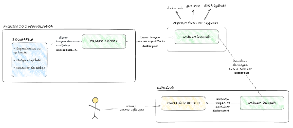
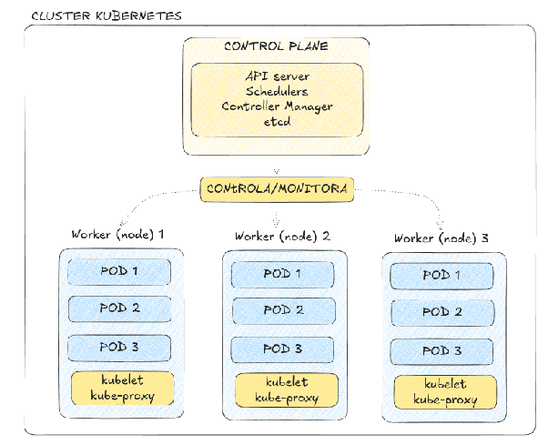
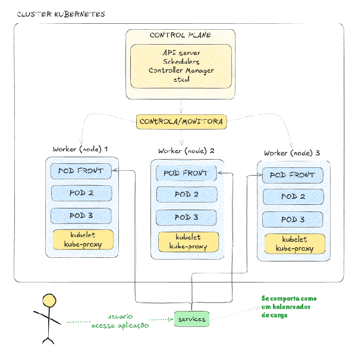
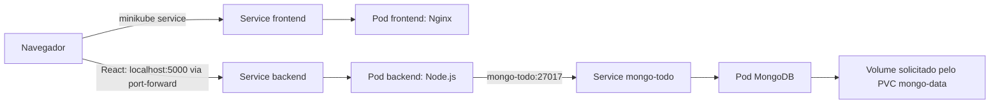
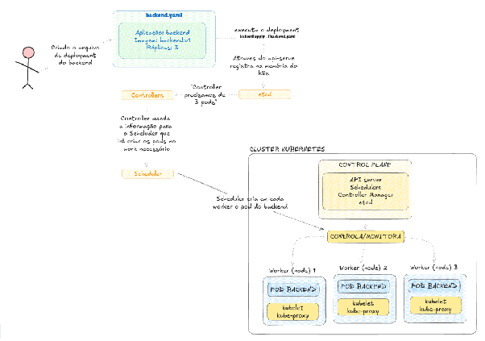

# Todo App - Docker e Kubernetes

Projeto academico para estudo de containers e Kubernetes com uma aplicacao full stack simples:

- `frontend`: React servido por Nginx.
- `backend`: API Node.js com Express.
- `banco-de-dados`: MongoDB com script inicial.
- `k8s`: manifests para executar a aplicacao em Kubernetes/Minikube.

Este conteudo foi importado do projeto `aula-uniamerica-infraestrutura-cloud` e preparado para esta branch de estudos com Kubernetes.

As imagens sao construidas a partir dos Dockerfiles de cada componente e executadas pelo Kubernetes.

## Estrutura

```text
.
|-- backend
|-- banco-de-dados
|-- frontend
`-- k8s
```

Os manifests Kubernetes sao separados por tipo de recurso:

```text
k8s/
|-- deployments/
|   |-- backend.yaml
|   |-- frontend.yaml
|   `-- mongo.yaml
|-- services/
|   |-- backend.yaml
|   |-- frontend.yaml
|   `-- mongo.yaml
|-- configmaps/
|   `-- backend.yaml
|-- secrets/
|   `-- mongo.yaml
|-- storage/
|   `-- mongo.yaml
|-- namespace.yaml
`-- kustomization.yaml
```

`deployments/` define as imagens e replicas; `services/` define o acesso aos
Pods. `configmaps/` guarda configuracoes comuns, `secrets/` os manifests de
credenciais e `storage/` as solicitacoes de armazenamento persistente.
O Secret `backend-secret` continua sendo criado a partir do arquivo local
`backend/.env`, conforme o tutorial abaixo. O Kustomize reune todos os manifests,
mantendo o comando `kubectl apply -k ./k8s`.

## Entendendo Kubernetes
### Do Dockerfile ao container

O **Dockerfile** descreve como preparar a aplicacao, suas dependencias e o
comando de inicializacao. O build gera uma **imagem**; um **container** e uma
instancia em execucao dessa imagem. Cada componente aqui tem seu Dockerfile:
frontend com React/Nginx, backend com Node.js e banco com MongoDB.



```text
Codigo + Dockerfile -> docker build -> Imagem -> Container em um Pod
```

Em outros ambientes, podemos publicar imagens em um registry para que os nodes
as baixem. Neste laboratorio, construimos diretamente no Docker do Minikube.
O Kubernetes executa as imagens; ele nao faz o build do codigo.

### Por que usar um orquestrador?

Com varios containers, precisamos manter instancias funcionando, distribuir
requisicoes e atualizar versoes. O **Kubernetes**, tambem chamado **k8s**,
coordena esses recursos a partir do estado desejado declarado nos manifests YAML.
Por exemplo: queremos um backend usando determinada imagem e com tres replicas.

### Cluster, control plane e nodes

Um **cluster** reune o control plane e os nodes que executam as cargas de
trabalho. Ele pode usar uma ou varias maquinas. Neste tutorial, o Minikube cria
um cluster local com um node, que tambem hospeda o control plane.



O desenho da aula ilustra tres worker nodes; nosso laboratorio usa um node.

| Componente | Responsabilidade |
| --- | --- |
| API Server | Recebe comandos do `kubectl` e disponibiliza a API do cluster. |
| etcd | Guarda os dados e as configuracoes do cluster; nao e o banco da aplicacao. |
| Scheduler | Escolhe um node para cada Pod ainda nao agendado, considerando recursos e restricoes. |
| Controller Manager | Executa controladores que conciliam o estado atual com o desejado. |
| Node | Maquina fisica ou virtual onde os Pods executam. |
| kubelet | Agente do node que garante a execucao dos containers definidos nos Pods. |
| Container runtime | Software que executa os containers no node. |

O scheduler nao aumenta replicas com base em erros HTTP ou uso de CPU. Escala
automatica exige um mecanismo como HPA, com metricas e configuracao apropriadas;
este projeto ainda nao configura autoscaling.
Referencia: [componentes do Kubernetes](https://kubernetes.io/docs/concepts/overview/components/).

### Pod e Deployment

O **Pod** e a menor unidade que o Kubernetes agenda. Pode conter um ou mais
containers que compartilham rede e volumes. Aqui, frontend, backend e MongoDB
executam em Pods separados. Um Pod nao representa toda a aplicacao.

Podemos criar Pods diretamente, mas usamos **Deployments** para gerenciar suas
replicas e atualizacoes. Um Deployment gerencia ReplicaSets, que mantem a
quantidade desejada de Pods. Exemplo de trecho de um manifesto:

```yaml
apiVersion: apps/v1
kind: Deployment
metadata:
  name: backend
  namespace: todo-app
spec:
  replicas: 3
  # O manifesto completo tambem define selector e template.
```

Se um Pod gerenciado desaparecer, o controlador cria um substituto; o scheduler
escolhe o node e o kubelet inicia os containers. Essa recuperacao faz parte do
**self-healing**. Para detectar aplicacoes travadas ou prontas para receber
trafego, tambem precisamos configurar probes; os manifests atuais nao as definem.

Tres replicas nao significam tres servidores: no Minikube elas podem executar
no mesmo node. Deployments tambem permitem **rolling updates**, substituindo
Pods gradualmente ao mudar a imagem no template. A disponibilidade depende da
estrategia, dos recursos livres e da verificacao de prontidao da aplicacao.

Referencias: [Pods](https://kubernetes.io/docs/concepts/workloads/pods/) e
[Deployments](https://kubernetes.io/docs/concepts/workloads/controllers/deployment/).

### Service e comunicacao

Pods sao substituiveis e seus IPs podem mudar. Um **Service** oferece um nome e
um endereco estaveis, selecionando Pods por labels e encaminhando o trafego.
Por isso, o backend usa `mongo-todo:27017`, em vez do IP de um Pod do MongoDB.



| Service neste projeto | Tipo | Acesso |
| --- | --- | --- |
| `frontend` | NodePort | Porta `30080` do node, acessada com `minikube service`. |
| `backend` | ClusterIP (padrao) | Interno na porta `5000`; usamos port-forward para acesso local. |
| `mongo-todo` | ClusterIP (padrao) | Interno na porta `27017`, usado pela API. |

O React executa no navegador: suas chamadas a API usam a URL publica configurada
no build. O DNS interno dos Services nao fica disponivel no navegador.
Referencia: [Services](https://kubernetes.io/docs/concepts/services-networking/service/).


```mermaid
flowchart LR
    browser[Navegador] -->|minikube service| frontService[Service frontend]
    frontService --> frontPod[Pod frontend: Nginx]
    browser -->|React: localhost:5000 via port-forward| backService[Service backend]
    backService --> backPod[Pod backend: Node.js]
    backPod -->|mongo-todo:27017| mongoService[Service mongo-todo]
    mongoService --> mongoPod[Pod MongoDB]
    mongoPod --> volume[Volume solicitado pelo PVC mongo-data]
```

### Configuracao e persistencia

| Recurso | Uso neste repositorio |
| --- | --- |
| Namespace | `todo-app` agrupa os recursos da aplicacao. |
| ConfigMap | `backend-config` fornece porta, ambiente e origens CORS. |
| Secret | `backend-secret` fornece a URI do banco; `mongo-secret` fornece as credenciais de inicializacao. |
| PersistentVolumeClaim (PVC) | `mongo-data` solicita armazenamento persistente para `/data/db`. |
| Kustomization | `k8s/kustomization.yaml` lista os manifests aplicados com `kubectl apply -k`. |

O volume permite manter os dados quando o Pod do MongoDB e substituido; ele nao
substitui backups. Cada componente esta configurado inicialmente com uma replica.

### Como tudo funciona junto?



O desenho distribui as replicas em tres nodes como exemplo; essa distribuicao
nao e garantida apenas por definir `replicas: 3`.

1. Construimos as tres imagens a partir dos Dockerfiles.
2. Aplicamos os manifests com `kubectl apply -k ./k8s` e fornecemos o Secret do backend.
3. Os controladores criam os Pods; o scheduler escolhe o node e o kubelet os executa.
4. Os Services permitem acessar o frontend e conectar a API ao banco.

Depois que a aplicacao estiver funcionando, experimente escalar apenas o backend:

```text
kubectl scale deployment/backend --replicas=3 -n todo-app
kubectl get pods -n todo-app -l app=backend
```

Para manter essa quantidade apos reaplicar os manifests, altere `spec.replicas`
em `k8s/deployments/backend.yaml`. Para voltar ao estado inicial, use `--replicas=1`.
Escalar o MongoDB exige configurar replicacao do banco; nao basta aumentar as
replicas do seu Deployment com o volume atual.

## Instalar Minikube e kubectl

O Minikube cria o cluster Kubernetes local deste projeto. Usaremos o driver
Docker; o `kubectl` sera usado para aplicar os manifests e consultar o cluster.
Nao e necessario habilitar o Kubernetes integrado do Docker Desktop.

### Pre-requisitos

- Pelo menos 2 CPUs, 2 GB de memoria livre e 20 GB de disco livre.
- Internet para baixar ferramentas, imagens e componentes do Kubernetes.
- Docker instalado e em execucao. Para este projeto, reserve 4 GB para o cluster.

Requisitos e instalacao: [guia oficial do Minikube](https://minikube.sigs.k8s.io/docs/start/).

### Windows (PowerShell, x86-64)

1. Instale o [Docker Desktop para Windows](https://docs.docker.com/desktop/setup/install/windows-install/)
   com o backend WSL 2, seguindo os requisitos do instalador. Reinicie se solicitado.
2. Abra o Docker Desktop e aguarde o engine iniciar. Use containers Linux.
3. Instale as ferramentas pelo `winget` no PowerShell:

```powershell
winget install -e --id Kubernetes.minikube
winget install -e --id Kubernetes.kubectl
```

Se `winget` nao estiver disponivel, instale/atualize o App Installer da Microsoft
Store ou use o instalador indicado no guia oficial do Minikube.
Feche e reabra o terminal (e o VS Code, se necessario) para atualizar o `PATH`.
Confira a instalacao:

```powershell
minikube version
kubectl version --client
docker info --format '{{.OSType}}'
```

O ultimo comando deve retornar `linux`. Caso retorne `windows`, altere o Docker
Desktop para Linux containers. Execute os passos seguintes no PowerShell do Windows.

Referencia: [instalacao do kubectl no Windows](https://kubernetes.io/docs/tasks/tools/install-kubectl-windows/).

### Linux (Bash, x86-64)

1. Instale o Docker Engine usando o [guia da sua distribuicao](https://docs.docker.com/engine/install/).
   Para Ubuntu, siga o [tutorial oficial](https://docs.docker.com/engine/install/ubuntu/).
2. Configure o acesso ao Docker sem `sudo`, conforme os
   [passos de pos-instalacao](https://docs.docker.com/engine/install/linux-postinstall/):

```bash
sudo usermod -aG docker "$USER"
```

Saia da sessao e entre novamente para aplicar o grupo. O grupo `docker` concede
privilegios equivalentes a root; execute o Minikube como usuario comum.
Confirme que o Docker esta acessivel:

```bash
docker info
```

3. Baixe e instale o Minikube:

```bash
curl -LO https://github.com/kubernetes/minikube/releases/latest/download/minikube-linux-amd64
sudo install minikube-linux-amd64 /usr/local/bin/minikube
minikube version
```

4. Baixe e instale o kubectl:

```bash
KUBECTL_VERSION=$(curl -L -s https://dl.k8s.io/release/stable.txt)
curl -LO "https://dl.k8s.io/release/${KUBECTL_VERSION}/bin/linux/amd64/kubectl"
sudo install -m 0755 kubectl /usr/local/bin/kubectl
kubectl version --client
```

Os comandos acima usam `curl` e a arquitetura `amd64` (`uname -m` retorna
`x86_64`). Em Linux ARM64 (`aarch64`), use `minikube-linux-arm64` no download e
na instalacao, e substitua `linux/amd64` por `linux/arm64` no download do kubectl.

Referencia: [instalacao do kubectl no Linux](https://kubernetes.io/docs/tasks/tools/install-kubectl-linux/).

### Criar e verificar o cluster

Execute no PowerShell ou Bash, com Docker em execucao:

```text
minikube start --driver=docker --container-runtime=docker --cpus=2 --memory=4096
minikube status
kubectl config use-context minikube
kubectl cluster-info
kubectl get nodes
```

O node deve aparecer como `Ready`. A primeira inicializacao pode demorar por
causa dos downloads. O Minikube configura o acesso ao cluster no kubeconfig.
O runtime Docker permite construir as imagens com `minikube docker-env` abaixo.
Referencia: [driver Docker do Minikube](https://minikube.sigs.k8s.io/docs/drivers/docker/).

Se houver incompatibilidade de versao do kubectl, use o cliente do Minikube:

```text
minikube kubectl -- get nodes
```

Essa alternativa tambem funciona para os demais comandos: substitua `kubectl`
por `minikube kubectl --`.

## Executar com Minikube

Com o cluster pronto, abra um terminal na raiz deste repositorio.
Aponte o Docker para o daemon do Minikube no mesmo terminal usado para o build.

Windows (PowerShell):

```powershell
minikube docker-env --shell powershell | Invoke-Expression
```

Linux (Bash):

```bash
eval "$(minikube docker-env --shell bash)"
```

Repita essa configuracao ao abrir outro terminal para construir imagens. Os
manifests usam `imagePullPolicy: Never`, portanto as imagens precisam existir
no Docker do Minikube. Os comandos restantes funcionam nos dois sistemas.

Crie as imagens usadas pelos manifests:

```powershell
docker build -t todo-mongo:latest ./banco-de-dados
docker build -t todo-backend:latest ./backend
docker build -t todo-frontend:latest ./frontend
```

Aplique os manifests:

```powershell
kubectl apply -k ./k8s
```

Prepare `backend/.env` com base em `backend/.env.example` e substitua os placeholders
da URI pelas credenciais do MongoDB. O arquivo local e ignorado pelo Git e pelo build.
Crie o Secret do backend depois de aplicar os manifests:

```powershell
kubectl create secret generic backend-secret --from-env-file=./backend/.env -n todo-app
```

O Deployment le apenas `MONGO_URI` desse Secret. `PORT`, `NODE_ENV` e `CORS_ORIGINS`
sao definidos pelo ConfigMap `backend-config` em `k8s/configmaps/backend.yaml`.
Enquanto o Secret nao existir, o container do backend aguardara sua criacao.
As credenciais devem corresponder ao usuario existente no MongoDB.

Abra o frontend:

```powershell
minikube service frontend -n todo-app
```

Inclua a origem exata exibida pelo Minikube (protocolo, host e porta, sem caminho)
em `CORS_ORIGINS` no ConfigMap. Depois reaplique os manifests e reinicie o backend:

```powershell
kubectl apply -k ./k8s
kubectl rollout restart deployment/backend -n todo-app
```

Para testar o frontend usando `localhost`, mantenha tambem um port-forward do backend:

```powershell
kubectl port-forward service/backend 5000:5000 -n todo-app
```

## Variaveis do backend

| Variavel | Uso | Padrao |
| --- | --- | --- |
| `MONGO_URI` | URI completa de conexao ao MongoDB | Obrigatoria, sem credenciais fixas no codigo |
| `PORT` | Porta HTTP da API | `5000` |
| `CORS_ORIGINS` | Origens HTTP/HTTPS permitidas, separadas por virgula | `http://localhost:3000,http://localhost` |
| `NODE_ENV` | Ambiente utilizado pelo Express e dependencias | `production` na imagem e no Kubernetes |

`backend/.env` nao e carregado automaticamente pelo Node.js; no Kubernetes, as
variaveis sao injetadas pelo Deployment. Para executar localmente, defina as
variaveis na sessao do terminal antes de executar `npm start` em `backend/`.
Ao alterar `PORT`, alinhe tambem `containerPort` e o port-forward nos manifests/comandos.
CORS controla o acesso pelo navegador e nao substitui autenticacao.

## Comandos uteis

```powershell
kubectl get all -n todo-app
kubectl logs deploy/backend -n todo-app
kubectl logs deploy/mongo -n todo-app
kubectl delete -k ./k8s
```

Para encerrar o cluster sem remove-lo e voltar a inicia-lo:

```text
minikube stop
minikube start
```

Para investigar uma falha na inicializacao:

```text
minikube logs
```

No Windows com driver Docker, mantenha aberto o terminal de `minikube service`
enquanto acessa o frontend, caso ele esteja mantendo o tunel de acesso.
